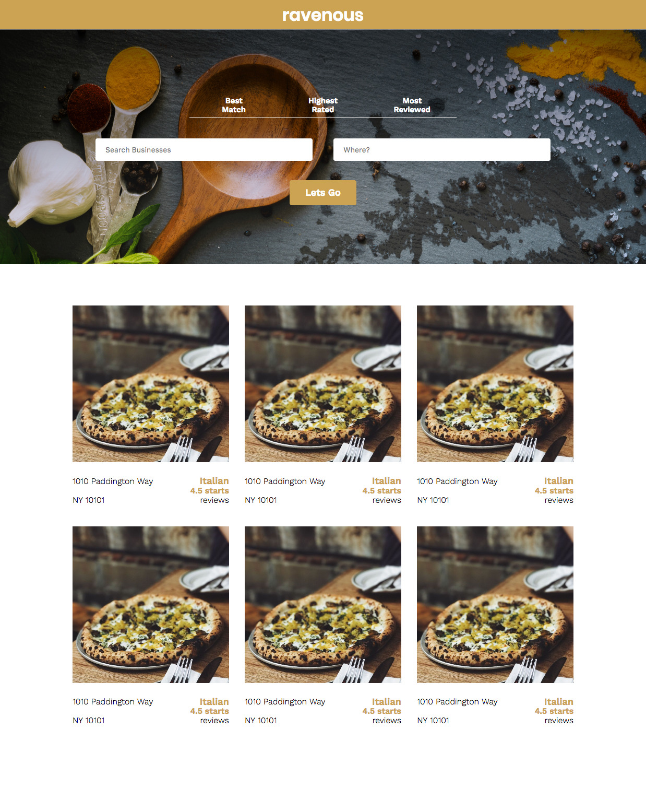

# 100 Days Of Code - Log

### Day 0: January 1, 2018
<table>
  <tr>
    <td width="50%" valign="center"></td>
    <td width="50%" valign="center"></td>
  </tr>
</table>


**Today's Progress**: Worked on building a minesweeper app as part of the Codecademy course I'm taking

**Thoughts:** This took me longer than the other stages of making the minesweeper game so far. I was working on it yesterday and ended up deleting the entire file this afternoon and starting over.  Going through the steps was much easier this time, but I'm still frustrated that until I read the steps I can't think of what they would be.

**Link to work:** [Codecademy: Build Front End Web Apps - Unit 1 - Minesweeper game
](https://github.com/heyryanleys/Codecademy-Build-Front-End-Web-Apps/blob/master/unit-1/minesweeper/src/minesweeper.js)  

### Day 1: January 2, 2018  

**Today's Progress**: Took notes about control flows, built a magic 8 ball app and an app that tells racers their start time based on their age the time they registered.

**Thoughts:** Thought this was much easier than yesterday-- I've used if else statements a lot in the past so the class part of today was pretty easy, although I didn't know about switch statements which seem very useful.

**Link to work:** [Codecademy: Build Front End Web Apps - Unit 1 - Day 13
](https://github.com/heyryanleys/Codecademy-Build-Front-End-Web-Apps/tree/master/unit-1/Day_13_Control%20Flow)  

### Day 2: January 3, 2018  

**Today's Progress**: Worked on the minesweeper game in my Codecademy course. Today I compared the bomb board and the player board to show when the tile contained a bomb, and if it didn't it would show the number of how many bombs were surrounding it.

**Thoughts:** This drove me nuts at first because I was having a very hard time understanding this method:  

```
neighborOffsets.forEach(offset => {
  const neighborRowIndex = rowIndex + offset[0];
  const neighborColumnIndex = columnIndex + offset[1];
  if (neighborRowIndex >= 0 && neighborRowIndex < numberOfRows && neighborColumnIndex >= 0 && neighborColumnIndex < numberOfColumns){
    if (bombBoard[neighborRowIndex][neighborColumnIndex] === 'B'){
      numberOfBombs++;
    };
  };
});
```  

It still is slightly confusing to me-- I'm going to repeat today's lesson tomorrow to make sure I can understand this before moving forward.

**Link to work:** [Codecademy: Build Front End Web Apps - Unit 1 - Minesweeper game
](https://github.com/heyryanleys/Codecademy-Build-Front-End-Web-Apps/blob/master/unit-1/minesweeper/src/minesweeper.js)  

### Day 3: January 4, 2018  

**Today's Progress**: Did yesterdays lesson from Codecademy again today

**Thoughts:** Had an easier time than yesterday but still having a tough time with this one, I have to move on to the next lesson tomorrow to not get behind, but I want to come visit this in a few days and see if the next lessons help me understand this one better.


**Link to work:** [Codecademy: Build Front End Web Apps - Unit 1 - Minesweeper game
](https://github.com/heyryanleys/Codecademy-Build-Front-End-Web-Apps/blob/master/unit-1/minesweeper/src/minesweeper.js)  

### Day 4: January 5, 2018  

**Today's Progress**: Worked on learning how to use Getters and Setters

**Thoughts:** Cool to work on this concept again after really not understanding it when I first learned about `this` and getters and setters in college.  I'm going to work through the example projects tomorrow before doing Day 17's lesson.


**Link to work:** [Codecademy: Build Front End Web Apps - Unit 1 - Day 16 - Setters and Getters
](https://github.com/heyryanleys/Codecademy-Build-Front-End-Web-Apps/tree/master/unit-1/Day_16_Getters%20and%20Setters)  

### Day 5: January 6, 2018  

**Today's Progress**: Redid yesterdays lesson from Codecademy

**Thoughts:** Ended up struggling to do the projects today so I redid the coursework from yesterday. This puts me a day behind schedule but the projects were much easier to complete after redoing the session.


**Link to work:** [Codecademy: Build Front End Web Apps - Unit 1 - Day 16 - Setters and Getters
](https://github.com/heyryanleys/Codecademy-Build-Front-End-Web-Apps/tree/master/unit-1/Day_16_Getters%20and%20Setters)  

### Day 6: January 7, 2018  

**Today's Progress**: Did the Day 17 work from Codecademy

**Thoughts:** Worked on creating classes instead of objects and how to set up superclasses.  Found this lesson much easier to pick up than the previous one.  Also created a program that could be used to log media at a library.  


**Link to work:** [Codecademy: Build Front End Web Apps - Unit 1 - Day 17 - Classes
](https://github.com/heyryanleys/Codecademy-Build-Front-End-Web-Apps/tree/master/unit-1/Day_17_Classes)  

### Day 6: January 8, 2018  

**Today's Progress**: Continuing to work on Minesweeper game  

**Thoughts:** Minesweeper game is coming along smoothly-- a lot of the time I feel like I'm just following the tutorial, but I've decided that that is part of learning it and I can come back to this again at the end of the course and see if it all makes sense then.  

**Link to work:** [Codecademy: Build Front End Web Apps - Unit 1 - Minesweeper game
](https://github.com/heyryanleys/Codecademy-Build-Front-End-Web-Apps/blob/master/unit-1/minesweeper/src/minesweeper.js)

### Day 7: January 9, 2018  

**Today's Progress**: Methods module from Codecademy

**Thoughts:** Can definitely see these being useful for data privacy and for keeping code from being compromised

**Link to work:** [Codecademy: Build Front End Web Apps - Unit 1 - Day 17 - Methods
](https://github.com/heyryanleys/Codecademy-Build-Front-End-Web-Apps/blob/master/unit-1/Day_19_Modules/Day%2019%20-%20Modules.md)  

### Day 8: January 11, 2018 << Was only able to code for 15 min yesterday before was interrupted, so counting it as a skip day.   

**Today's Progress**: Finished up the module lessons and also did the project about browser compatibility and transpilation.

**Thoughts:** Found both of these lessons to be pretty digestible.  The amount of different ways to export and import modules seemed like a lot to take in, but I imagine it's rare that developers use all of the different ways to import and export.

**Link to work:** [Codecademy: Build Front End Web Apps - Unit 1 - Day 17 - Methods
](https://github.com/heyryanleys/Codecademy-Build-Front-End-Web-Apps/blob/master/unit-1/Day_19_Modules/Day%2019%20-%20Modules.md)  
[Codecademy: Build Front End Web Apps - Unit 1 - Day 18 - Browser compatibility
](https://github.com/heyryanleys/Codecademy-Build-Front-End-Web-Apps/blob/master/unit-1/Day_20_Browser_Compatibilty/Day%2020%20-%20Browser%20Compatibility%20and%20Transpilation.md)  

### Day 9: January 12, 2018  

<p align="center"> </p>

**Today's Progress**: Did two days of Codecademy class as well as some work on a careers webpage for my company

**Thoughts:** Decided since it was friday to crack a beer and breeze through the next two days of my codecademy course.  We started a new unit on react, but the first two days are about the basics of HTML and CSS.  HTML and CSS are where I'm most comfortable so I was able to fly through the work today. (I didn't take any notes, so there's no commit from the class today).  

With the careers page I didn't make too much progress-- It's very frustrating because I have to work with an older CMS that doesn't allow for me to edit the stylesheet directly so the way I'm writing my code is pretty forceful in the sense that I have to overwrite a lot of code that exists.  In the end, there is a hard time constraint and limited flexibility on the CMS, so it's either doing it this way or having a careers page that looks straight out of the 90s.

**Link to work:** [Careers Landing Page](https://github.com/heyryanleys/Careers-Landing-Page)  

### Day 10: January 13, 2018  

**Today's Progress**: Did two more days of the Codecademy course i'm taking, both on React and JS

**Thoughts:** Pretty cool to start learning an entirely new framework. Today I banged out two more days of the course to catch up since I spent some extra time on methods and setters + getters.  A lot of JSX is simlar to HTML so it was fairly quick to pick up.  

**Link to work:** [Codecademy: Build Front End Web Apps - Unit 2 - Day 3 - Methods](https://github.com/heyryanleys/Codecademy-Build-Front-End-Web-Apps/blob/master/unit-2/day-3-jsx-1/day-3-JSX-1.md)  
[Codecademy: Build Front End Web Apps - Unit 2 - Day 4 - Methods](https://github.com/heyryanleys/Codecademy-Build-Front-End-Web-Apps/blob/master/unit-2/day-4-jsx-2/day-4%20-JSX-2.md)  

### Day 11: January 14, 2018  

**Today's Progress**: Banged out 3 days worth of work for my course so I am now back on track timeline wise.

**Thoughts:** Today I went through learning about creating and using components in React and how to run a React app on a local server.  Another day where things seemed to click pretty quickly-- no complaints here!  

**Link to work:** [Codecademy: Build Front End Web Apps - Unit 2 - Day 5 - Components](https://github.com/heyryanleys/Codecademy-Build-Front-End-Web-Apps/blob/master/unit-2/day-5-components/day-5-components.md)  
[Codecademy: Build Front End Web Apps - Unit 2 - Day 6 - Components](https://github.com/heyryanleys/Codecademy-Build-Front-End-Web-Apps/blob/master/unit-2/day-6-components/day-6-components.md)  
[Codecademy: Build Front End Web Apps - Unit 2 - Day 7 - testapp](https://github.com/heyryanleys/Codecademy-Build-Front-End-Web-Apps/tree/master/unit-2/day-7-creating-react-app/testapp)  

### Day 12: January 15, 2018  

<p align="center">  </p>  

**Today's Progress**: Created the first demo app for the yelp clone I'll be making during this course.

**Thoughts:** Felt very strong during this-- it was cool to see how components are really used in programs.  There was still the aspect of going through the steps with this one, but I understood everything I wrote which is much more than I can say when I was going through the Minesweeper program 😊

**Link to work:** [Codecademy: Build Front End Web Apps - Unit 2 - Day 8 & 9 - Ravenous](https://github.com/heyryanleys/Codecademy-Build-Front-End-Web-Apps/tree/master/unit-2/day-8-9-ravenous-project/ravenous)  

### Day 13: January 16, 2018  

**Today's Progress**: Did today's work from Codecademy and learned about passing information between components, such as other components or props.

**Thoughts:** Definitely a bit more a confusing topic to think about using in practice than the previous days. I understand how to pass props and components to other components, but I'm not fully able to think about how this is used on a larger scale.

**Link to work:** [Codecademy: Build Front End Web Apps - Unit 2 - Day 10 - Components and Props ](https://github.com/heyryanleys/Codecademy-Build-Front-End-Web-Apps/blob/master/unit-2/day-10-components-and-props/day-10-components-and-props.md)  

### Day 14: January 17, 2018  

**Today's Progress**: Worked on a second page for our careers website.

**Thoughts:** I've been redoing our careers pages at work-- previously we had one page that has a list of the jobs and you could email us to apply for a job.  I've been setting up a landing page that tells you about the company, a second page that has the job postings on them, a third page which has the details of the actual job and then a final online application for the position. Working with our CMS is frustrating and all of the CSS I add has to be added onto the page without being able to access the main css files, so there are a lot of `!important` tags being used which I dislike, but I have to use them for now.

**Link to work:** [Careers Landing Page](https://github.com/heyryanleys/Careers-Landing-Page)  

### Day 15: January 18, 2018  

**Today's Progress**: Worked on the job postings pages

**Thoughts:** Created the template that will be used for the each individual job postings and then created the job posting pages.

**Link to work:** [Careers Landing Page](https://github.com/heyryanleys/Careers-Landing-Page)  

### Day 16: January 19, 2018  

**Today's Progress**: Created an online application for our open careers.  

**Thoughts:** This was cool because I used some of the JS I learned in Codecademy to make it so that there is just one page for the application, and depending on which job the user clicked on on the previous page, the application said the job they're applying for at the top of the page and automatically populates a hidden form field on the application so we can see which job they applied for.  This means rather than making a new page for every job application I can just manage one page.

**Link to work:** [Careers Landing Page](https://github.com/heyryanleys/Careers-Landing-Page)  

### Day 17: January 20, 2018  

**Today's Progress**: Did two more days of my Codecademy course-- worked more on the ravenous application, learned about state and created an app that randomly chooses a background color when a button is clicked.

**Thoughts:** This is getting more difficult, I still have a pretty easy time going through the step but there is still the lingering thought that I'm not sure how I would have come up with the solution if I didn't have the steps. After this course is over I'm going to start FreeCodeCamp as I heard that is more challenge based rather than tutorial based.

**Link to work:** [Codecademy: Build Front End Web Apps - Unit 2 - Day 8 & 9 - Ravenous](https://github.com/heyryanleys/Codecademy-Build-Front-End-Web-Apps/tree/master/unit-2/day-8-9-ravenous-project/ravenous)  
[Codecademy: Build Front End Web Apps - Unit 2 - Day 12 - State - Notes ](https://github.com/heyryanleys/Codecademy-Build-Front-End-Web-Apps/blob/master/unit-2/day-12-state/day-12-state.md)  
[Codecademy: Build Front End Web Apps - Unit 2 - Day 12 - State - Random Color Generator ](https://github.com/heyryanleys/Codecademy-Build-Front-End-Web-Apps/tree/master/unit-2/day-12-state/random-color-generator)  

### Day 18: January 21, 2018  

**Today's Progress**: Did three days of the Codecademy course (They were short).

**Thoughts:** I was struggling with the concept but the video player app was helpful in understanding why there are multiple child components to display and change the parent component. I'm stuck a bit on the video player though, the code looks right to me so I'm not sure exactly what the error is.

**Link to work:** [Codecademy: Build Front End Web Apps - Unit 2 - Day 13 - Passing Information 1](https://github.com/heyryanleys/Codecademy-Build-Front-End-Web-Apps/blob/master/unit-2/day-13-passing-information-1/day-13-passing-information-1.md)  
[Codecademy: Build Front End Web Apps - Unit 2 - Day 14 - Passing Information 2 ](https://github.com/heyryanleys/Codecademy-Build-Front-End-Web-Apps/blob/master/unit-2/day-14-passing-information-2/day-14-passing%20-information-2.md)  
[Codecademy: Build Front End Web Apps - Unit 2 - Day 15 - Passing Information 3 - Notes ](https://github.com/heyryanleys/Codecademy-Build-Front-End-Web-Apps/blob/master/unit-2/day-15-passing-information-3/day-15-passing-information-3.md)  
[Codecademy: Build Front End Web Apps - Unit 2 - Day 15 - Passing Information 3 - Video PLayer ](https://github.com/heyryanleys/Codecademy-Build-Front-End-Web-Apps/tree/master/unit-2/day-15-passing-information-3/video-player)  

### Day 19: January 22, 2018  

**Today's Progress**: Worked on creating a new landing page for high profile tradeshows we're having in 2018  

**Thoughts:** Pretty standard work for what I've been doing within our CMS at work.  Still happy with the results I'm able to get but unhappy that I have use `!important` to overwrite so much of the original styles.

**Link to work:** [Careers Landing Page](https://github.com/heyryanleys/Careers-Landing-Page)  

### Day 20: January 23, 2018  

**Today's Progress**: Today I worked on another part of the yelp clone for my Codecademy course.

**Thoughts:** This was a classic case of feeling like I was going through the motions.  Seems to be a theme where I really understand the concepts of each lesson before the projects, but I have a hard time figuring out how to use them together in a real world application.

**Link to work:** [Codecademy: Build Front End Web Apps - Unit 2 - Day 8 & 9 - Ravenous](https://github.com/heyryanleys/Codecademy-Build-Front-End-Web-Apps/tree/master/unit-2/day-8-9-ravenous-project/ravenous)  

### Day 21: January 24, 2018  

**Today's Progress**: Started designing a new email template that looks like an infographic.

**Thoughts:** At work one of our content creators made an infographic that we wanted to send out in an email, so took the design and started coding it into an email template

**Link to work:** /In a private repo-- I know it's against the rules of 100 days of code but it's not ready to be made a public repo/  

### Day 22: January 25, 2018  

<p align="center"> </p>  

**Today's Progress**: Finished creating the infographic email

**Thoughts:** Pretty happy with the way this came out for only having a few hours to build it!  Worked great on all devices I was able to test it on.

**Link to work:** /In a private repo/  

### Day 23: January 27, 2018  << Had to miss yesterday, had a very long week at work and wasn't able to dedicate enough attention to the next lesson in the Codecademy course

**Today's Progress**: Did day 17's readings on API requests and day 18's lesson on Requests

**Thoughts:** Cool to learn how to work with APIs! Still feel like there's a step we haven't gone over on how to take this code and make it functional, but the lesson tomorrow is also on requests so I'm hoping it will be covered then.

**Link to work:**  [Codecademy: Build Front End Web Apps - Unit 2 - Day 18 - Requests ](https://github.com/heyryanleys/Codecademy-Build-Front-End-Web-Apps/blob/master/unit-2/day-18-requests/day-18-requests.md)  

### Day 25: January 29, 2018

<p align="center"> </p>  

**Today's Progress**: Finished the yelp app clone!

**Thoughts:** Excited to be done with this project-- I learned a lot through it but by the end I was starting to feel lost.  I'm looking forward to starting the next project which accesses Spotify's API because I think it will be a lot of the same ideas as the last one so it will be good to go back to the beginning and hopefully I'll understand some concepts that I just pluged in on the Yelp one to get through it.

**Link to work:** [Codecademy: Build Front End Web Apps - Unit 2 - Day 8 & 9 - Ravenous](https://github.com/heyryanleys/Codecademy-Build-Front-End-Web-Apps/tree/master/unit-2/day-8-9-ravenous-project/ravenous)    
